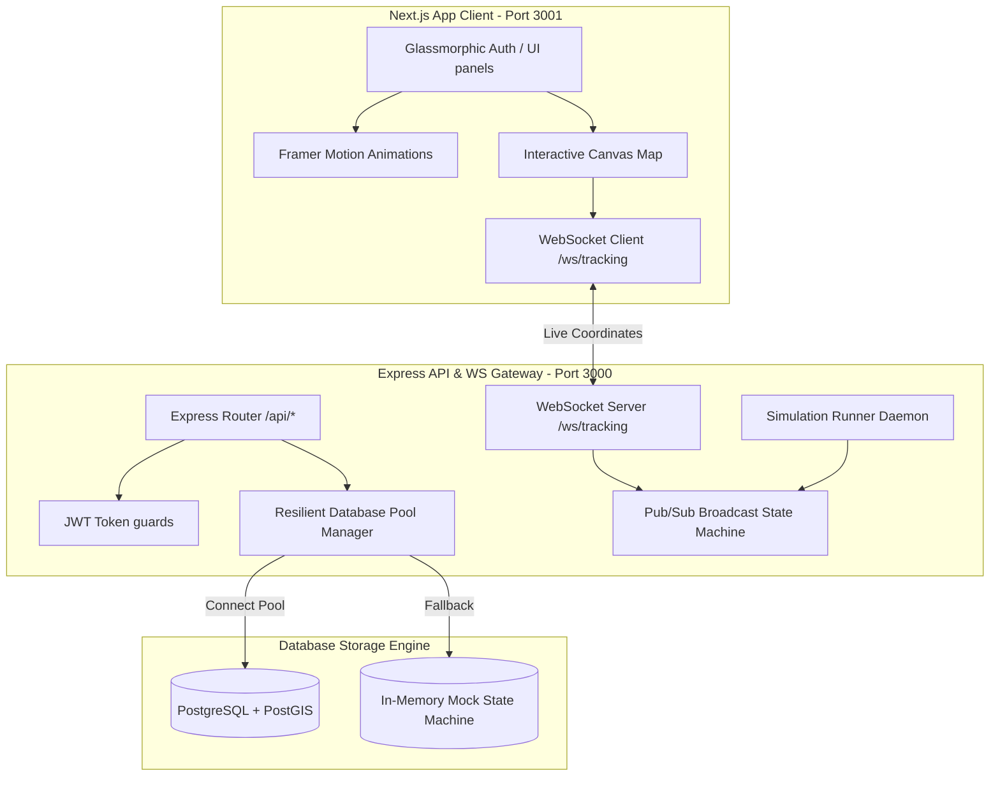

# 📍 HyperLocal Marketplace (API + Real-Time Dispatch Engine)

[](https://nextjs.org/)
[](https://react.dev/)
[](https://www.typescriptlang.org/)
[](https://nodejs.org/)
[](https://tailwindcss.com/)
[](https://expressjs.com/)
[](https://developer.mozilla.org/en-US/docs/Web/API/WebSockets_API)
[](https://www.framer.com/motion/)

An advanced, full-stack, production-grade hyperlocal logistics and marketplace application. The platform connects consumers with nearby merchants, handles transactional checkouts with row-level locking inventory, and maps delivery couriers live using WebSockets, custom 2D canvas interpolation rendering (LERP), and glassmorphism.

---

## 🌟 Key Highlights & Innovations

### 1. Dual-Mode Resilient Database Layer (`db.ts`)
- **Autodetect PG/PostGIS Engine:** The system dynamically attempts to initiate a pooled connection to PostgreSQL/PostGIS.
- **Failover Mock DB State Machine:** If PostgreSQL is offline or inaccessible, the application automatically triggers an in-memory database simulation client. This mock client supports SQL query normalization, ACID transaction mocks (`BEGIN`, `COMMIT`, `ROLLBACK`), row-level locks (`FOR UPDATE NOWAIT`), and spatial distance mathematical queries using the Haversine formula.

### 2. High-Fidelity 2D Canvas Mapping Engine
- Built from scratch without heavy map wrapper dependencies (like Google Maps or Mapbox).
- Renders customer geolocations, shops, pulsing delivery coverage radiuses, and active drivers.
- **Vector Interpolation (LERP):** Sub-second coordinates broadcast from the backend are interpolated smoothly inside a requestAnimationFrame rendering loop to make courier markers glide seamlessly across streets.
- Full viewport pan-dragging and scroll-wheel zoom scaling.

### 3. State-Machine Dispatch Simulation Daemon
- Runs asynchronous simulation threads representing delivery couriers.
- Coordinates progression updates: `PLACED` ➔ `CONFIRMED` ➔ `PREPARING` ➔ `READY_FOR_PICKUP` ➔ `OUT_FOR_DELIVERY` (generates spatial steps from shop to customer) ➔ `DELIVERED`.
- Secure WebSocket dispatch channels using bearer JSON Web Tokens.

---

## 🏗️ System Architecture



---

## 📁 Repository Directory Structure

```
├── backend/                   # Node.js + Express API & WS server code
│   ├── src/
│   │   ├── services/
│   │   │   ├── checkout_service.ts     # Row-locked transactional order checkout
│   │   │   ├── notification_service.ts # SMS / push broadcast channels
│   │   │   └── websocket_tracking.ts   # WS pub/sub coordination
│   │   ├── db.ts                       # Dual-mode PG pool + Mock SQL client
│   │   ├── server.ts                   # App endpoints & driver simulation threads
│   │   ├── api.test.ts                 # Full E2E service integration tests
│   │   └── verify.test.ts              # Unit and WS handshake tests
│   ├── package.json
│   └── tsconfig.json
│
├── frontend/                  # Next.js App Router SPA Client
│   ├── src/
│   │   ├── app/
│   │   │   ├── checkout/               # Checkout Summary & Payment Form Page
│   │   │   ├── dashboard/              # Shop Browser Grid & Interactive Map Page
│   │   │   ├── owner/                  # Shop Owner Command Dashboard Page
│   │   │   ├── tracking/[id]/          # WebSocket Gliding Live Courier Page
│   │   │   ├── globals.css             # Tailwind v4 variables and custom styles
│   │   │   ├── layout.tsx              # Root Layout with Font Configurations
│   │   │   └── page.tsx                # Welcome page & Canvas Particle Auth Screen
│   │   ├── components/ui/             # shadcn reusable design tokens (button, card, etc.)
│   │   └── lib/utils.ts                # Class merger tailwind helper
│   ├── next.config.ts                  # API proxied rewrites config
│   ├── package.json
│   └── tsconfig.json
│
├── task.md                    # Task and feature checklists
└── walkthrough.md             # Integration testing logs
```

---

## ⚙️ Ultimate Setup & Installation Guide

### Prerequisites
Make sure you have the following installed:
1. [Node.js](https://nodejs.org/) (Version 18 or 20 recommended)
2. [npm](https://www.npmjs.com/) (Version 9+ / bundled with Node.js)
3. *(Optional)* [Docker Desktop](https://www.docker.com/) (to run PostgreSQL/PostGIS database image)

---

### Step 1: Clone the Codebase
Clone this repository to your local folder and navigate into the root directory:
```bash
git clone https://github.com/wasifshaffaq/hyperlocal-marketplace.git
cd hyperlocal-marketplace
```

---

### Step 2: Configure and Boot the Backend Service
1. Navigate to the backend directory:
   ```bash
   cd backend
   ```
2. Install npm dependencies:
   ```bash
   npm install
   ```
3. Create your local environment configuration file:
   Create a `.env` file in the `backend/` folder and populate it:
   ```env
   PORT=3000
   JWT_SECRET=super_secret_hyperlocal_json_web_token_key_1337
   
   # PostgreSQL Connection configurations (System automatically uses Mock DB if offline)
   DB_USER=postgres
   DB_HOST=localhost
   DB_NAME=hyperlocal
   DB_PASSWORD=postgres
   DB_PORT=5432
   ```
4. Start the backend developer server:
   ```bash
   npm run dev
   ```
   *Expected Console output:*
   ```
   API + WS Server running on port 3000
   [DB] PostgreSQL offline. Resilient fallback activated: running MockInMemoryDatabase!
   ```

---

### Step 3: Configure and Launch the Next.js Frontend
1. Open a new terminal console and navigate to the frontend directory:
   ```bash
   cd ../frontend
   ```
2. Install dependencies:
   ```bash
   npm install
   ```
3. Launch the development server:
   ```bash
   npm run dev -- -p 3001
   ```
   *Note: Binding to `-p 3001` explicitly prevents conflicts with the backend port 3000.*
4. Open your browser to **[http://localhost:3001](http://localhost:3001)**.

---

## 🧪 Running Integration Tests
The project features E2E Mocha tests. These tests spin up local Express routers, mount mock database schemas, perform socket handshakes, and run coordinate dispatches.

To run the test suite:
1. Open a terminal and navigate to `backend/`.
2. Run:
   ```bash
   npm test
   ```

*Typical Test Output:*
```
--- Running Checkout Service Tests ---
[PASS] Successful checkout returns success: true
[PASS] Returns the correct generated orderId
[PASS] Starts a transaction
[PASS] Commits the transaction on success
[PASS] Checkout fails with insufficient stock
[PASS] Rolls back transaction on insufficient stock

--- Running WebSocket Real-Time Tracking Tests ---
[PASS] Connecting without token closes with code 1008
[PASS] Connecting with invalid token closes with code 1008
[PASS] Customer receives driver location updates in real-time
```

---

## 📡 REST API & Websocket Protocol Contract

### Auth Endpoints
#### `POST /api/auth/register`
Creates a user profile.
- **Request Body:**
  ```json
  {
    "email": "customer@test.com",
    "password": "secure_password",
    "role": "CUSTOMER",
    "phone": "+15551234"
  }
  ```

#### `POST /api/auth/login`
Validates credentials and responds with a bearer token.
- **Response:**
  ```json
  {
    "success": true,
    "data": {
      "token": "JWT_TOKEN_STRING",
      "role": "CUSTOMER",
      "id": "user-uuid"
    }
  }
  ```

### Shop Discovery & Orders
#### `GET /api/shops?lat=37.7749&lng=-122.4194`
Returns stores located inside the delivery bounds of the coordinate payload.

#### `POST /api/checkout`
Submits checkout cart details securely using row locks on product items.
- **Request Body:**
  ```json
  {
    "shopId": "shop-grocery",
    "addressId": "address-uuid",
    "slotId": "slot-standard",
    "cartItems": [
      { "productId": "prod-apple", "quantity": 3 }
    ],
    "paymentDetails": {
      "cardNumber": "4242424242424242",
      "cvv": "123",
      "expiry": "12/28"
    }
  }
  ```

### WebSocket Dispatch Events
Connect via: `ws://localhost:3000/ws/tracking`

#### 1. Subscribe Packet (Client ➔ Server)
```json
{
  "type": "subscribe",
  "orderId": "order-uuid-here"
}
```

#### 2. Status Progression Broadcast (Server ➔ Client)
```json
{
  "type": "STATUS_UPDATE",
  "orderId": "order-uuid-here",
  "status": "PREPARING"
}
```

#### 3. Coordinate Update Broadcast (Server ➔ Client)
```json
{
  "type": "LOCATION_UPDATE",
  "orderId": "order-uuid-here",
  "lat": 37.7771,
  "lng": -122.4172
}
```

---

## 🛠️ Troubleshooting & FAQs

| Symptom | Direct Cause | Corrective Action |
|---|---|---|
| `Port 3000 is already in use` | Another server instance is running on port 3000 | Find and terminate the process, or update the `PORT` env parameter in `.env` |
| `WebSocket connection failed` | WS client tried to reach the wrong host or socket path | Ensure backend server is running and client connects to `ws://localhost:3000/ws/tracking` |
| `Checkout fails with stock shortage` | The mock database limits item stock | Log in as Shop Owner, switch to the **Shop Menu Catalog** tab, and add stock to the product |
| `Cannot connect to Postgres` | PostgreSQL daemon is offline | No action required! The application falls back to the high-end `MockInMemoryDatabase` without crashing |